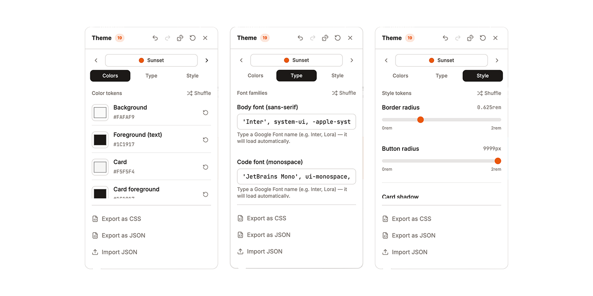

<h1 align="center">Theme Editor</h1>
<p align="center">A floating visual theme editor for any React + Tailwind CSS v4 project.<br>Tweak colors, fonts, radius, and shadows live in the browser.</p>
<p align="center"><a href="#install"><strong>Install</strong></a></p>

<p align="center">
  
</p>

<p align="center">
  
</p>

---

I prefer making design token changes visually, pick colors, swap fonts, see how everything fits together. so I built a Claude Code skill that injects a visual theme editor into your running app.

## What it does

Type `/theme-editor` in [Claude Code](https://claude.com/claude-code) and it injects a floating popover into your running dev server. Tweak your design tokens live in the browser — colors, fonts, border radius, shadows, spacing — and see changes instantly.

**Features:**
- 14 curated color presets with prev/next navigation
- 10 Google Font pairings with auto-loading
- 6 style combos (Sharp, Rounded, Default, Soft, Bold, Minimal)
- Shuffle per category or shuffle everything at once
- Undo/redo with Cmd+Z / Cmd+Shift+Z
- Export as CSS or JSON, import from JSON
- LocalStorage persistence across page refreshes
- Dev-only rendering (stripped from production builds)
- Project-aware — adapts to your actual CSS variables

## How it works

The skill has three phases:

| Command | What happens |
|---------|-------------|
| `/theme-editor` | **Inject** — Audits your CSS tokens, restructures static variables if needed, copies 11 files into your project, wires the editor into your root layout |
| "apply this theme" + JSON | **Apply** — Writes the exported theme values permanently into your CSS file |
| "remove theme editor" | **Remove** — Deletes all injected files and cleans up imports. Keeps the CSS improvements. |

## Requirements

- [Claude Code](https://claude.com/claude-code) CLI
- A React project with **Tailwind CSS v4+**
- CSS file using `@theme inline {}` or `@theme {}` with CSS variables

## Install

In Claude Code, run:

```
/plugin add madebysan/theme-editor
```

Or install manually:

```bash
git clone https://github.com/madebysan/theme-editor.git
cp -r theme-editor/skill ~/.claude/skills/theme-editor
```

## Usage

1. Open a React + Tailwind v4 project in Claude Code
2. Type `/theme-editor`
3. Refresh your browser — paintbrush icon appears in the bottom-left corner
4. Click to open the editor popover
5. Tweak colors, fonts, and style tokens
6. When happy, export as JSON and say "apply this theme" to make it permanent
7. Say "remove theme editor" to clean up the injected files

<details>
<summary><strong>What's inside</strong></summary>

```
skill/
├── SKILL.md                    # Skill instructions (what Claude reads)
├── assets/                     # Template files injected into your project
│   ├── ThemeDrawer.tsx         # Main floating popover UI
│   ├── ColorControl.tsx        # Color picker with hex input
│   ├── FontControl.tsx         # Font input with Google Fonts auto-loading
│   ├── RangeControl.tsx        # Range slider for numeric tokens
│   ├── ChoiceControl.tsx       # Segmented button group
│   ├── ThemeExportImport.tsx   # Export CSS/JSON, import JSON
│   ├── useTheme.ts             # State management with undo/redo
│   ├── theme-defaults.ts      # Token definitions (generated per project)
│   ├── theme-presets.ts        # 14 presets, 10 font pairings, 6 style combos
│   ├── theme-storage.ts       # localStorage persistence
│   └── theme-apply.ts         # CSS variable application
└── references/                 # Reference docs for the Apply phase
    ├── variable-catalog.md     # All shadcn CSS variables
    └── css-patterns.md         # CSS pattern detection guide
```

</details>

## License

[MIT](LICENSE)

---

Made by [santiagoalonso.com](https://santiagoalonso.com)
